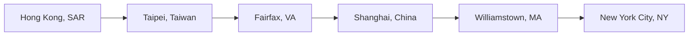

- 👋 Hi, I’m Kaizen.
- 💞️ I love Ultimate Frisbee and Disc Golf.
- 🌱 I’m currently an SDE at Amazon working on the [AWS CDK](https://github.com/aws/aws-cdk).
- 📫 You can reach me through my [website](https://kaizencc.github.io/).

<!---
kaizencc/kaizencc is a ✨ special ✨ repository because its `README.md` (this file) appears on your GitHub profile.
You can click the Preview link to take a look at your changes.
--->
